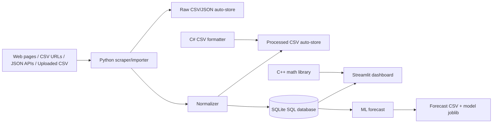

# Architecture

## Design choices

- SQLite is used first because it is simple, portable, and good for MVP/local deployment.
- Streamlit gives a minimalist internal-tool interface quickly.
- Python handles scraping, storage, charts, and ML.
- C++ is optional for performance-sensitive formulas.
- C# is optional for enterprise/Desktop integration or CSV formatting utilities.

## Suggested real Indonesian sources to configure

Use sources only where access is permitted:

- BPS public tables for inflation, commodity statistics, demographics.
- Bank Indonesia public pages/APIs for FX, rates, macro indicators.
- IDX/OJK public datasets for listed-company/market information.
- Your own marketplace seller/export CSVs.
- Internal sales/order CSVs.

## Next production upgrades

- PostgreSQL instead of SQLite.
- Login/auth and user roles.
- Scrapy/Playwright workers for dynamic pages.
- Airflow/Prefect for scheduled scraping.
- Docker deployment.
- Model monitoring and backtesting.
